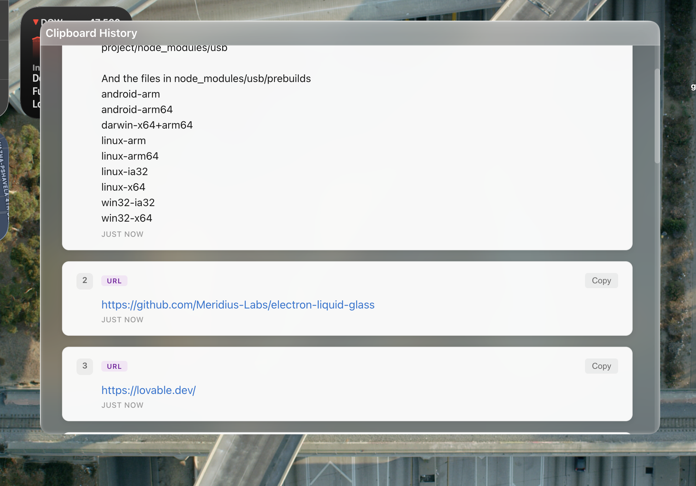

# clipai

[](https://github.com/mberrishdev/clipai/releases)
[](https://github.com/mberrishdev/clipai/issues)
[](LICENSE)

A modern clipboard history manager built with Electron, React, and Bun. Runs in your system tray (macOS menu bar / Windows taskbar) with a beautiful transparent UI.



## Features

- **Automatic Clipboard Monitoring** - Captures clipboard text and images automatically
- **Image Support** - Save and preview screenshots and copied images
- **Smart Content Detection** - Detects JSON, URLs, colors, emails, and base64
- **Syntax Highlighting** - Beautiful JSON formatting with syntax highlighting
- **Transparent UI** - Beautiful frosted glass effect (toggleable)
- **System Tray App** - Runs in background, accessible from system tray
- **Cross-Platform** - Works on macOS and Windows
- **Settings** - Customize transparency and other options
- **Fast** - Built with Bun for lightning-fast performance
- **In-Memory Storage** - Clipboard history stored in memory (clears on restart)

## Tech Stack

- **Electron** - Desktop app framework
- **React** - UI library
- **Bun** - JavaScript runtime and bundler
- **TypeScript** - Type safety
- **Vite** - Frontend tooling

## Project Structure

```
src/
├── main/
│   ├── main.ts              # Electron main process
│   ├── preload.ts           # Preload script (IPC bridge)
│   └── clipboardManager.ts  # Clipboard monitoring logic
└── renderer/
    ├── pages/
    │   ├── ClipboardHistory.tsx  # Main clipboard history view
    │   ├── ClipboardHistory.css
    │   ├── Settings.tsx          # Settings page
    │   └── Settings.css
    ├── main.tsx             # React entry point
    ├── App.tsx              # Main app component with routing
    └── types.d.ts           # TypeScript definitions
```

## Prerequisites

- [Bun](https://bun.sh) v1.0 or higher
- macOS or Windows

## Installation

1. Clone the repository:
```bash
git clone https://github.com/yourusername/clipai.git
cd clipai
```

2. Install dependencies:
```bash
bun install
```

## Development

Start the development server:

```bash
bun run dev
```

This will:
- Start Vite dev server for the renderer (React UI)
- Compile the preload script in watch mode
- Launch Electron app

## Build

Build for production:

```bash
bun run build
```

This creates:
- `dist/renderer/` - Built React app
- `dist/main/` - Compiled Electron main process

Package the app:

```bash
bun run package
```

Creates platform-specific installers in `release/`:
- **macOS**: `.dmg` and `.zip` files (Intel x64 and Apple Silicon arm64)
- **Windows**: `.exe` installer (NSIS) and portable `.exe`

## Usage

### System Tray
- **macOS**: Look for the icon in the menu bar (top-right)
- **Windows**: Look for the icon in the system tray (bottom-right, notification area)
- Click the tray icon to show/hide the window
- Right-click (or left-click on Windows) for menu options:
  - **Show Clipboard History** - View all copied items
  - **Settings** - Configure app preferences
  - **Quit** - Exit the application

### Settings
- **Window Transparency** - Toggle transparent/opaque background

### Clipboard History
- Automatically saves all clipboard text and images
- Smart detection: JSON, URLs, colors, emails
- Click URLs to open in default browser
- Click items to copy back to clipboard
- Ignores empty or whitespace-only entries
- Clears when app is restarted

### Logs
- **macOS**: `~/Library/Logs/clipai/main.log`
- **Windows**: `%APPDATA%\clipai\logs\main.log`

## Scripts

- `bun run dev` - Start development mode
- `bun run dev:renderer` - Start Vite dev server only
- `bun run dev:preload` - Build preload script
- `bun run dev:electron` - Start Electron only
- `bun run build` - Build for production
- `bun run build:renderer` - Build React app
- `bun run build:main` - Build main process
- `bun run build:preload` - Build preload script
- `bun run package` - Package app for distribution
- `bun run package:dir` - Package without creating installer (faster for testing)

## License

MIT
